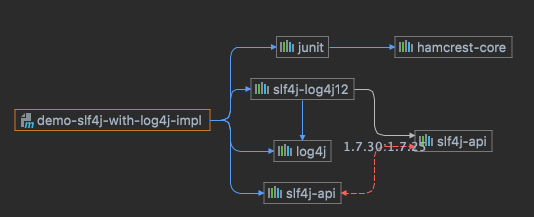
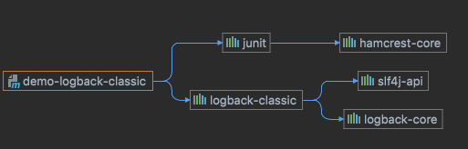
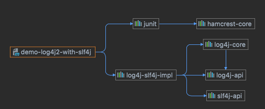

> 背景: 
> 不知道你是否在看到一堆的日志配置时手足无措,一些看起来很相似的包,不知道该用哪一个. 

比如: 
- `log4j-over-slf4j.jar`
- `slf4j-log4j12.jar`
- `log4j-slf4j-impl.jar`

这些包看起来非常相似,名称经常换来换去. 不知道该引入哪一个好. 如果都存在,又会产生什么问题. 而这个Project就是来把这些问题一一说明白的.

# java-log-explore

此项目旨在搞明白java不同的日志框架之间的使用细节. 旨在理明白那些让人迷惑的日志桥接以及混用的处理办法. 对于每一种典型的用法提供一个完整的最小demo.
争取把所有的问题一次性说明白. 


## log4j-over-slf4j.jar AND bound slf4j-log4j12.jar on the class path 是什么问题 

这个问题通常发生在使用 slf4j 和 log4j 的组合记录日志时，出现了两个日志框架互相依赖的情况。其中 log4j-over-slf4j.jar 是 slf4j 提供的一种适配器，在使用 slf4j-wrapped log4j 时使用的，而 slf4j-log4j12.jar 是 slf4j 和 log4j 集成的一个 jar 包。

这个问题的原因是，log4j-over-slf4j.jar 和 slf4j-log4j12.jar 都包含了 slf4j 和 log4j 的相关类。在应用程序的 classpath 上如果同时存在这两个 jar 包，就会出现类冲突，导致日志框架无法正确记录日志信息，出现不可预期的错误和异常。

解决这个问题的方法是，只选择使用其中一个日志框架并移除另一个依赖。如果选择使用 log4j，就需把 log4j-over-slf4j.jar 从 classpath 中排除，并只使用 slf4j-log4j12.jar。反之亦然，如果选择使用 slf4j，就需把 slf4j-log4j12.jar 从 classpath 中排除，并确保只使用 log4j-over-slf4j.jar。

在 Maven 中，可以通过在 pom.xml 文件中排除不需要的依赖来解决这个问题。例如：


> 注: 下面示例代码的依赖关系中 log4j-over-slf4j 并不实际依赖 slf4j-log4j12 , 仅作示意展示. 
```xml
<dependencies>  
  <dependency>
    <groupId>org.slf4j</groupId>
    <artifactId>slf4j-api</artifactId>
    <version>1.7.25</version>
    <scope>compile</scope>
  </dependency>  
  <dependency>
    <groupId>org.slf4j</groupId>
    <artifactId>log4j-over-slf4j</artifactId>
    <version>1.7.25</version>
    <scope>compile</scope>
    <exclusions>
      <exclusion>
        <groupId>org.slf4j</groupId>
        <artifactId>slf4j-log4j12</artifactId>
      </exclusion>
    </exclusions>
  </dependency>
</dependencies>
```


# 最终总结:


> 下面这些总结性的话, 其它的你不想的看话没关系.  这个总结不要错过. 

最开始的日志框架是分散的,不同的日志框架有不同的日志接口标准与实现. 而为了解决这个日志框架不统一的问题. 于是就提出了 `slf4j` 日志接口标准. 

这个标准的目标是让不同的日志系统都不直接依赖具体的日志实现. 都统一使用这个`slf4j` 日志接口. 而这个接口标准可以选择不同的具体实现. 比如可以选
log4j, 也可以选择 log4j2, 同时还可以选择 logback等. 这些是初衷,也是现状. 


最开始的时候, 这个标准提出来了, 但是没有标准的实现. 也就是说的业务系统里面可以换为统一的`slf4j`的日志接口来打日志. 但是最开始的时候还没有标准的
slf4j的实现. 这个时候大家都觉得是log4j的日志实现可以作为一个标准的实现. 这样再把其它的日志转发(桥接)到log4j实现上. 这样就实现了统一. 

但是一开始log4j并不是按这个接口来实现的. 也就是说即使是候选的标准实现. 都没法直接用.得进行适配. 

这样在 `log4j1x`时代, 我们就有一个 `slf4j` 的 `log4j实现`适配方案: 这个就是: `slf4j-log4j12`

```xml
<!--   把 slf4j 适配到 log4j的实现   -->
        <dependency>
            <groupId>org.slf4j</groupId>
            <artifactId>slf4j-log4j12</artifactId>
            <version>1.7.30</version>
        </dependency>
```

这样,在使用标准的slf4j接口的时候, 后端实现就可以转发到`log4j`了.  这个就是 `slf4j-log4jxx` 相关包的由来.




后来, 新的日志系统.比如: `logback` 就直接以`slf4j`作为其标准接口进行实现了. 这个时候的`slf4j`的接口到标准的后端实现时就不需要再转一道,就
是原生的实现. 就像在logback-classic中会引入`slf4j-api`的包一样. 这个logback 提供的日志接口就是标准的 `sfl4j` 标准接口. 
同时如果在要替换slf4j的实现的时候, 就直接把logback相关的包全部排除掉就行. 再单独引入相关的其它的slf4j标准的api包和实现包就可以了. 



后来log4j改版与重构时, 也就是后面我们所谓的最好性能的`log4j2`包. 这个时候. 从包结构来看. 与log4j的时候其它保持类似. 其在封装为 `slf4j`接口
进行打日志时, 也需要一个适配包. 也就是: `log4j-slf4j-impl`



一句话说明区别: 

- `slf4j-log4j12` 是在log4 1时代的时候,使用 log4j 提供给slf4j作为实现的适配包.
- `log4j-slf4j-impl` 是在log4j 2时代的时候, 使用log4j2  提供给slf4j作为实现的适配包.

实际从依赖与实现结构看, log4j与slf4j的结合和原理上看,这两个包是一样的. 只是针对于不同的版本. 但是命名上有所区别. 1时代的命名明显是以 slf4j
为中心的命名. 表明这是一个 slf4j的实现包.或者是适配包. 这样对应的可能就有其它的slf4j标准实现包. 

但是,后来的命名发生了变化, 由于所有的新日志系统都是直接以slf4j 接口作为标准实现了. 这个时候就没有日志统一框架的概念了,只有统一接口. 因此不再是
slf4j不同的back 实现. 而是以日志框架本身为中心, 同时其自己输出的接口就是slf4j接口. 

这就是log42为什么是以 log4j2 在前面的命名. 而1x的时候是 slf4j-xx的命名. 因为不存在一个统一的框架,然后在使用的时候进行"配置"选择实现. 这个
从logback的实现就可以更进一步的看出来. 因为log4j2还有自己的api类和包.(log4j-api) , 但logback直接以slf4j-api作为标准接口进行实现.


##＃　slf4j-log4j12 与 log4j-slf4j-impl 原理与区别是什么? 

> 来自于chatGPT

slf4j-log4j12 和 log4j-slf4j-impl 是两个不同的库，用于在应用程序中实现日志记录功能。它们之间的原理和区别如下：

slf4j-log4j12
slf4j-log4j12 是一个SLF4J的实现，它使用log4j作为底层的日志引擎，可以将SLF4J的日志消息转发到log4j来实现日志记录。在使用时，需要在类路径下包含log4j的jar文件以及slf4j-log4j12的jar文件。

log4j-slf4j-impl
log4j-slf4j-impl 是log4j2中的一个SLF4J桥接实现，可以将所有使用SLF4J API的应用程序日志记录请求重定向到log4j2中。它的主要作用是在使用SLF4J API的应用程序中，使用log4j2作为底层的日志实现。需要注意的是，log4j-slf4j-impl的使用需要在应用程序中排除原始的SLF4J jar文件。

因此，两者的区别在于底层的日志实现不同，但它们的主要功能是相同的：将SLF4J API的日志记录请求重定向到底层的日志实现。

可以看到.其主体不一样, 其它是一个东西的两面.一个是站在slf4j的角度进行阐述.另外一个是站在 log4j的角度进行阐述. 