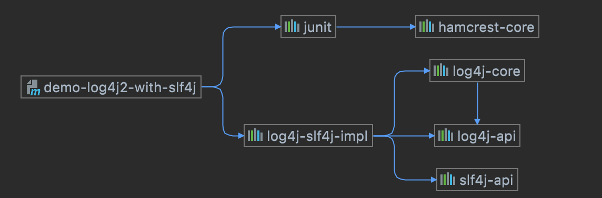

一个完整的log4j2的日志demo 

> 此示例是依赖了slf4j的一个实现. 也是官方推荐的使用方式. 

在 pom.xml 中添加 log4j2 依赖：

```xml
<dependency>
    <groupId>org.apache.logging.log4j</groupId>
    <artifactId>log4j-slf4j-impl</artifactId>
    <version>2.14.0</version>
</dependency>
```

注意查看一个maven依赖关系图: 这个实际是把log4j-core和log4j-api都间接引用进来了. 可以猜测 `slf4j`也间接使用了`log4j-api`的接口. 
只是对外暴露的是标准的`slf4j-api` 接口. 即图中间接引入的另外一个JAR包: `slf4j-api`



在 src/main/resources/log4j2.xml 中添加 log4j2 的配置：


```xml
<?xml version="1.0" encoding="UTF-8"?>
<Configuration status="WARN">
    <Appenders>
        <Console name="Console" target="SYSTEM_OUT">
            <PatternLayout pattern="%d{HH:mm:ss.SSS} [%t] %-5level %logger{36} - %msg%n" />
        </Console>
    </Appenders>
    <Loggers>
        <Root level="INFO">
            <AppenderRef ref="Console" />
        </Root>
    </Loggers>
</Configuration>
```

在代码中记录日志：


```java
import org.apache.logging.log4j.LogManager;
import org.apache.logging.log4j.Logger;

public class Log4j2Demo {
    private static final Logger logger = LogManager.getLogger(Log4j2Demo.class);

    public static void main(String[] args) {
        logger.trace("Trace level message");
        logger.debug("Debug level message");
        logger.info("Info level message");
        logger.warn("Warn level message");
        logger.error("Error level message");
        logger.fatal("Fatal level message");
    }
}
```

在代码中，首先需要导入 org.apache.logging.log4j.LogManager 和 org.apache.logging.log4j.Logger 包，通过 LogManager.getLogger() 方法获取一个 Logger 对象，用于记录日志。

然后，在代码中，我们按照不同的日志级别来记录日志，例如 trace、debug、info、warn、error 和 fatal 等级别。通过运行代码，日志会被记录到控制台中。

需要注意的是，code 中的 logging code 以 INFO 级别输出。如果需要输出其他级别的日志消息，需进行配置。具体可参考 log4j2 的文档。


> 注意

log4j2 不一定要依赖 slf4j，但 slf4j 是 log4j2 官方推荐的使用方式，使用 slf4j + log4j2 的组合能够充分发挥 log4j2 的性能和功能，同时也可以方便地替换 log4j2 为其他日志框架提供支持。

slf4j 是一个简单的**日志门面库**，它为 log4j2、logback、Java 日志等多个日志框架提供了统一的 API。使用 slf4j 可以抽象出应用程序代码中的日志框架依赖，使得应用程序在运行时可以使用任何一个符合 slf4j 规范的日志框架作为实际日志输出的实现。这也实现了应用和日志框架的解耦。

当然，如果不想使用 slf4j，仍然可以在应用程序代码中直接使用 log4j2 的 API 记录日志，只需要在 pom.xml 文件中添加 log4j2 依赖，并在 src/main/resources 目录下创建 log4j2.xml 配置文件即可。但使用 slf4j 可以更加方便地进行日志的管理和配置。


具体不依赖`slf4j`的版本demo 可以参考: 本工程的: `demo-log4j2`

