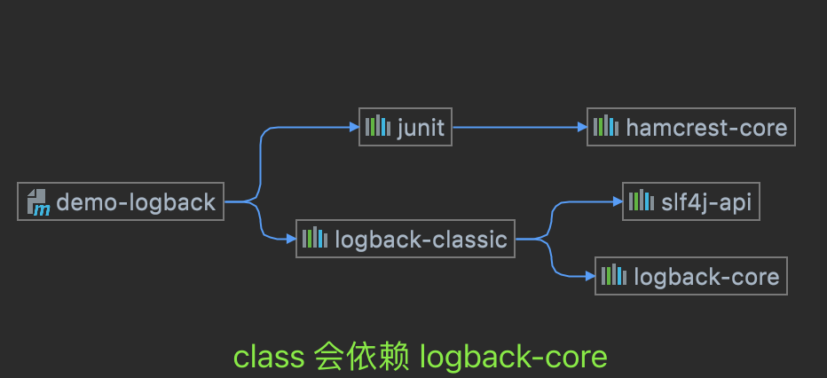
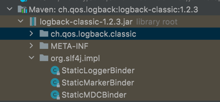

这里是一个基于 Logback 的 Java 日志完整示例：

首先，创建一个 Maven 项目，然后添加以下依赖项：


```xml
<dependencies>
  <!-- Logback Classic模块，包含logback-core模块 -->
  <dependency>
    <groupId>ch.qos.logback</groupId>
    <artifactId>logback-classic</artifactId>
    <version>1.2.3</version>
  </dependency>
</dependencies>
```

友情提示: logback-classic 会依赖 logback-core , 换句话说: logback-classic 会间接引入 logback-core




接下来，创建一个名为 logback.xml 的文件，放在 src/main/resources 目录下，用于配置 Logback。以下是一个简单的配置例子：


```xml
<?xml version="1.0" encoding="UTF-8"?>
<configuration>
    <!--定义日志文件的存储路径和文件名-->
    <property name="LOG_HOME" value="./logs" />
    <property name="PATTERN" value="%d %p %c{1.} [%t] %m%n" />

    <!--控制台输出日志-->
    <appender name="STDOUT" class="ch.qos.logback.core.ConsoleAppender">
        <encoder>
            <pattern>${PATTERN}</pattern>
        </encoder>
    </appender>

    <!--按时间切割日志，每隔一天生成一个新的日志文件-->
    <appender name="ROL" class="ch.qos.logback.core.rolling.RollingFileAppender">
        <file>${LOG_HOME}/test.log</file>
        <rollingPolicy class="ch.qos.logback.core.rolling.TimeBasedRollingPolicy">
            <fileNamePattern>${LOG_HOME}/test-%d{yyyy-MM-dd}.log</fileNamePattern>
        </rollingPolicy>
        <encoder>
            <pattern>${PATTERN}</pattern>
        </encoder>
    </appender>

    <!--默认日志级别：DEBUG-->
    <root level="DEBUG">
        <appender-ref ref="STDOUT" />
        <appender-ref ref="ROL" />
    </root>
</configuration>
```


该配置文件定义了两个 appender: STDOUT 和 ROL。STDOUT 负责将日志输出到控制台。ROL 负责将日志按时间切割，并将日志输出到文件中。每隔一天，将生成一个新的日志文件。

现在，编写一个使用这个日志配置的示例类：


```java
package com.fresh.jianhongl.demo.logback;

import org.slf4j.Logger;
import org.slf4j.LoggerFactory;

public class LogbackDemo {
    private static Logger logger = LoggerFactory.getLogger(LogbackDemo.class);

    public static void main(String[] args) {
        logger.debug("Debug message");
        logger.info("Info message");
        logger.warn("Warn message");
        logger.error("Error message");
    }
}

```

## Ｑ＆Ａ

### logback-classic 与 logback-core两个包有什么关系. 该怎么正确使用他们 

Logback 是一个模块化的框架，提供了三个模块：logback-core、logback-classic 和 logback-access。其中，logback-core 模块提供了 Logback 框架的核心组件，而 logback-classic 模块则提供了与 SLF4J 和 Log4j 的兼容性。 logback-access 模块是可选的，提供了与 Servlet 容器的集成。

可以将 Logback 分为两个部分：核心框架部分（logback-core）和与其他框架集成部分（logback-classic）。

logback-classic 模块包含了 logback-core 模块，以及对 SLF4J 和 Log4j 的兼容性支持。因此，如果你使用 logback-classic 模块，就不需要单独使用 logback-core 模块。Logback-classic 模块是使用 Logback 的建议方式，因为它支持多种日志框架，并且提供了更完整的功能。

**如果你不需要与其他框架兼容，并且只想使用 Logback 的核心功能，那么可以只使用 logback-core 模块**


### logback-classic 的具体作用与 log4j-slf4j-impl 之间有什么异同. 


这两个包,都在自己的视角实现了一个把自己的API转换为 slf4j标准的API接口的实现. 我们可以看一下这两个包的内容:

下面是`logback-class`包的内容.:



可以看到这里面有部分与`log4j-slf4j-impl`包一样的内容有相似之处. 那就是 `slf4j.impl`包. 这个包里面有`slf4j`日志工厂的绑定类.
在前面的log4j的代码分析中,已经查看了这个绑定关系是log4j中是把日志factory绑定到 `org.apache.logging.slf4j.Log4jLoggerFactory`.然后这个
工厂会生成一个代理的logger: `org.apache.logging.slf4j.Log4jLogger` , 然后代理的   `logger`在具体的实现时委托
给接口: `org.apache.logging.log4j.spi.ExtendedLogger` , 
然后这个接口的实现就是具体的log4j-core中的真正的实现类:`org.apache.logging.log4j.core.Logger` 


同样在这里,logback-classic也有相似的逻辑. 

```java
package org.slf4j.impl;

import ch.qos.logback.classic.LoggerContext;
import ch.qos.logback.classic.util.ContextInitializer;
import ch.qos.logback.classic.util.ContextSelectorStaticBinder;
import ch.qos.logback.core.joran.spi.JoranException;
import ch.qos.logback.core.status.StatusUtil;
import ch.qos.logback.core.util.StatusPrinter;
import org.slf4j.ILoggerFactory;
import org.slf4j.helpers.Util;
import org.slf4j.spi.LoggerFactoryBinder;

public class StaticLoggerBinder implements LoggerFactoryBinder {
    public static String REQUESTED_API_VERSION = "1.7.16";
    static final String NULL_CS_URL = "http://logback.qos.ch/codes.html#null_CS";
    private static StaticLoggerBinder SINGLETON = new StaticLoggerBinder(); // 指向自己的一个单例
    private static Object KEY = new Object();
    private boolean initialized = false;
    private LoggerContext defaultLoggerContext = new LoggerContext();
    private final ContextSelectorStaticBinder contextSelectorBinder = ContextSelectorStaticBinder.getSingleton();

    private StaticLoggerBinder() {
        this.defaultLoggerContext.setName("default");
    }

    public static StaticLoggerBinder getSingleton() {
        return SINGLETON;
    }

    static void reset() {
        SINGLETON = new StaticLoggerBinder();
        SINGLETON.init();
    }

    void init() {
        try {
            try {
                (new ContextInitializer(this.defaultLoggerContext)).autoConfig();
            } catch (JoranException var2) {
                Util.report("Failed to auto configure default logger context", var2);
            }

            if (!StatusUtil.contextHasStatusListener(this.defaultLoggerContext)) {
                StatusPrinter.printInCaseOfErrorsOrWarnings(this.defaultLoggerContext);
            }

            this.contextSelectorBinder.init(this.defaultLoggerContext, KEY);
            this.initialized = true; // 初始化完成后,把初始化状态标记为 true. 
        } catch (Exception var3) {
            Util.report("Failed to instantiate [" + LoggerContext.class.getName() + "]", var3);
        }

    }

    // 返回 LoggerFactory的地方. 
    public ILoggerFactory getLoggerFactory() {
        if (!this.initialized) {
            return this.defaultLoggerContext;
        } else if (this.contextSelectorBinder.getContextSelector() == null) {
            throw new IllegalStateException("contextSelector cannot be null. See also http://logback.qos.ch/codes.html#null_CS");
        } else {
            /** 
             * 实际的factory是类: {@link ch.qos.logback.classic.LoggerContext} 这个类实现了接口: ILoggerFactory
             * 最后这个factory返回的logger类是: {@link ch.qos.logback.classic.Logger} , 
             * 而这logger实际上是直接继承了: {@link  org.slf4j.Logger}  , 换句话说: logback的实现就是slf4j的一个标准参考实现.
             * 不像 log4j的实现是用了一个外部的包装类或者是代理类来转发完成. 
             * */
            return this.contextSelectorBinder.getContextSelector().getLoggerContext();
        }
    }

    public String getLoggerFactoryClassStr() {
        return this.contextSelectorBinder.getClass().getName();
    }

    // 单例在类加载的时候会自动初始化.
    static {
        SINGLETON.init();
    }
}

```


