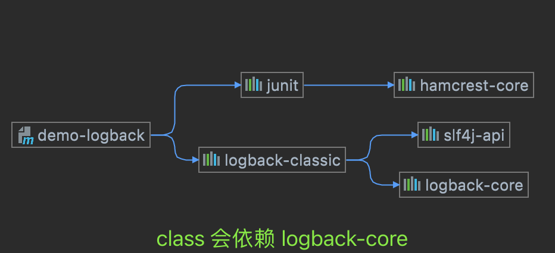

这里提供一个标准的slf4j-api环境, 而且slf4j-api的默认实现我们使用 logback来实现. 

通过前面的示例: `demo-logback-classic` , 我们知道: 实际logback本身就是按标准的`slf4j-api`来实现的. 
如果要引用一个标准的`logback`实现的`slf4j-api`,只需要引用一个`logback-classic`即可. 其它的依赖就间接引入进来了.这样也让人能非常清晰
明确的知道日志实现的层次关系.

这里再贴一个 logback-classic 相关的日志依赖:




现在,由于有一些老的日志.它没有使用slf4j这么一个标准的接口来完成日志的编写. 也就是他们有自己的接口和实现. 比如log4j. 
我们知道log4j的日志实现需要引入的maven仓库包的清单如下:

```xml
<dependency>
    <groupId>log4j</groupId>
    <artifactId>log4j</artifactId>
    <version>1.2.17</version>
</dependency>
```

但是,现在我不想使用这个log4j的日志实现输出了. 我想统一重定向到我这里使用的 logback , 因为这样我才可以统一的去控制日志的输出格式与是否输出等配置. 
或者说我可以使用这一个更先进的日志输出系统. 屏蔽掉旧的log4j包相关的bug等. 这个时候怎么做呢. 

我们需要把`log4j`的相关的实现**桥接**到 slf4j上去. 然后再由`slf4j`选择具体实现来完成日志输出. 我们之前的示例: `demo-log4j` 这个示例中已经
展示了基本的log4j日志的使用方法.

其示例如下:

```java
package com.fresh.jianhongl.demo.log4j;

import org.apache.log4j.Logger;


public class MainEntry {
    // 这里的Logger的类是引用的是: org.apache.log4j.Logger. 也就是具体的log实现框架.
    private static final Logger logger = Logger.getLogger(MainEntry.class);

    public static void main(String[] args) {

        logger.trace("Trace message.");
        logger.debug("Debug message.");
        logger.info("Info message.");
        logger.warn("Warn message.");
        logger.error("Error message.");
        logger.fatal("Fatal message.");
    }
}
```

我们看下在正确的log4j包中的这个logger.info是怎么实现的:

```java
// org.apache.log4j.Category.info(java.lang.Object)
public class Category implements AppenderAttachable {
    
    // ....
    
    public void info(Object message) {
        if (repository.isDisabled(Level.INFO_INT))
            return;
        if (Level.INFO.isGreaterOrEqual(this.getEffectiveLevel()))
            forcedLog(FQCN, Level.INFO, message, null);
    }
}

```

我们再看下over包提供的Logger:


其包的路径可以发现是和原包是一模一样的. 都是: `org.apache.log4j.Logger` ,同时他们有一个相同的名为: `Category`的父类. 其中有info方法的实现:


这个实现的注释已经说明了其是委托给了 slf4j.Logger.info 去实现了. 我们看一下其中调用的`differentiatedLog()`的实现.
这样就把一个原始的 log4j的Logger替换为了我们的over包里的Logger. 然后这个Logger再委托给slf4j的接口去打印. 而这个接口又再选择具体的实现来
完成日志输出. 这样log4j的日志就完成了向logback的输出. 


最后我们再看一下此项目的整体依赖:


## Q&A

### 还有其它类型的over包吗,该怎么使用. 

有的. 上面说了,后面新的日志框架直接将slf4j作为标准的日志接口来直接实现. 这样业务中的代码就不会与具体的slf4j的实现有耦合. 在运行环境中有怎样的实现包.
即我们上面分析过的 StaticLoggerBinder类. 就会由这个绑定类来完成具体的slf4j日志接口的实现绑定. 这样就不需要手工再去解耦. 只要替换实现就行. 

这个与servlet-api与servlet的容器实现原理相似.只要在依赖的时候只依赖接口.然后在运行时就可以提供不同的实现. 用户无感知也不需要知道. 比如这个
容器实现可以是`tomcat`也可以是`undertow`. 也可以是`jetty`等. 

回到原问题, 现在的日志系统还有很多的不是标准实现的日志接口.或者说是有其不同的标准. 比如 java commons logging. 


```xml
 <dependencies>
    <!-- Java Commons Logging redirect to slf4j  -->
    <dependency>
        <groupId>org.slf4j</groupId>
        <artifactId>jcl-over-slf4j</artifactId>
    </dependency>
    <!-- Apache log4j redirect to slf4j  -->
    <dependency>
        <groupId>org.slf4j</groupId>
        <artifactId>log4j-over-slf4j</artifactId>
    </dependency>
    <!-- Java Util Logging redirect to slf4j  -->
    <dependency>
        <groupId>org.slf4j</groupId>
        <artifactId>jul-to-slf4j</artifactId>
    </dependency>
</dependencies>
```